# NovaStore - E-Ticaret Mobil Uygulaması

Modern ve kullanıcı dostu bir e-ticaret mobil uygulaması. Flutter ile geliştirilmiştir.

## 📱 Uygulama Özellikleri

### Temel Özellikler
- ✅ **Ürün Listeleme:** API'den gelen ürünlerin GridView ile gösterimi
- ✅ **Kategori Filtreleme:** Dinamik kategori chip'leri ile ürün filtreleme
- ✅ **Ürün Arama:** Search bar ile gerçek zamanlı ürün arama (başlık ve kategoriye göre)
- ✅ **Kombineli Filtreleme:** Kategori ve arama filtrelerini birlikte kullanabilme
- ✅ **Ürün Detayı:** Detaylı ürün bilgileri, fiyat, rating ve açıklama
- ✅ **Favoriler Sistemi:** Ürünleri favorilere ekleme/çıkarma
- ✅ **Sepet Yönetimi:** Ürün ekleme, miktar güncelleme, toplam hesaplama
- ✅ **Checkout Süreci:** Adres seçimi, ödeme yöntemi, sipariş özeti
- ✅ **Bottom Navigation:** Ana Sayfa, Favoriler, Sepet, Profil

### Gelecekte Eklenebilecek Özellikler
- 🔜 **Görsel Arama:** Kamera ile ürün arama
- 🔜 **Kullanıcı Profili:** Giriş/kayıt sistemi
- 🔜 **Sipariş Geçmişi:** Geçmiş siparişleri görüntüleme
- 🔜 **Ürün Sıralama:** Fiyat, rating, popülerliğe göre sıralama

### Teknik Özellikler
- 🎨 **Material Design 3** ile modern UI tasarımı
- 🔄 **State Management:** ChangeNotifier pattern ile state yönetimi
- 🏗️ **Clean Architecture:** Services, Models, Components yapısı
- 📡 **API Integration:** REST API ile veri çekme (DummyJSON)
- 🚀 **Navigation:** Navigator ve IndexedStack ile sayfa geçişleri
- 💾 **Local State:** CartService ve FavoritesService

## 🛠️ Teknolojiler

- **Flutter SDK:** 3.24.5
- **Dart SDK:** 3.5.4
- **Platform:** Android/iOS
- **State Management:** ChangeNotifier
- **HTTP:** Dart http package

## 📦 Kullanılan Paketler

```yaml
dependencies:
  flutter:
    sdk: flutter
  http: ^1.2.0
  flutter_dotenv: ^5.1.0
```

## 🚀 Kurulum ve Çalıştırma

### Gereksinimler
- Flutter SDK (3.24.5 veya üzeri)
- Android Studio veya Xcode
- Android Emulator veya iOS Simulator

### Adımlar

1. **Projeyi Klonlayın:**
```bash
git clone https://github.com/kullaniciadin/novastore-app.git
cd novastore-app
```

2. **Bağımlılıkları Yükleyin:**
```bash
flutter pub get
```

3. **Uygulamayı Çalıştırın:**
```bash
flutter run
```

## 📂 Proje Yapısı

```
lib/
├── main.dart                 # Uygulama giriş noktası
├── components/               # Tekrar kullanılabilir widget'lar
│   ├── bottom_bar.dart
│   ├── product_card.dart
│   ├── category_chips.dart
│   ├── search_input.dart
│   ├── banner_slider.dart
│   └── my_button.dart
├── models/                   # Veri modelleri
│   ├── product.dart
│   ├── cart_item.dart
│   └── ...
├── pages/                    # Uygulama sayfaları
│   ├── home_screen.dart
│   ├── product_detail_screen.dart
│   ├── cart_screen.dart
│   ├── favorites_screen.dart
│   ├── checkout_screen.dart
│   └── profile_screen.dart
└── services/                 # İş mantığı servisleri
    ├── product_service.dart
    ├── cart_service.dart
    └── favorites_service.dart
```

## 📸 Ekran Görüntüleri

### Ana Sayfa ve Arama
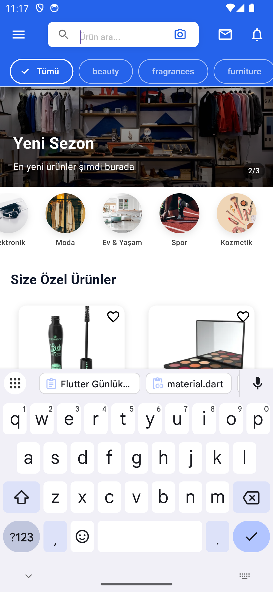 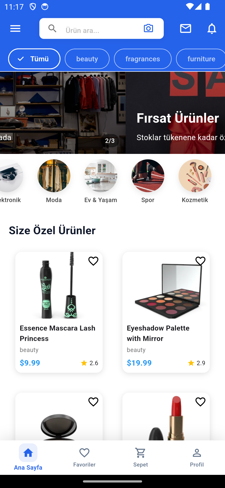

### Sepete Ekleme ve Kategori Filtreleme
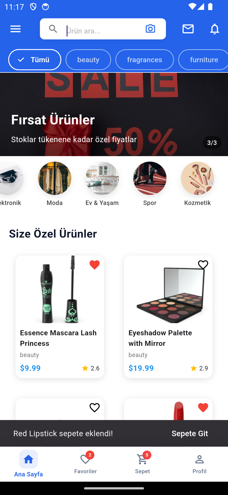 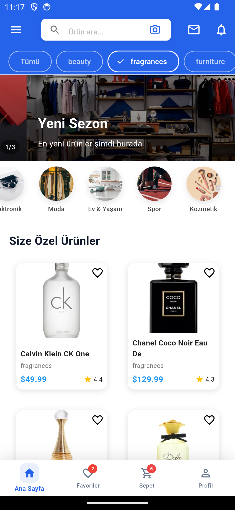

### Favoriler ve Sepet
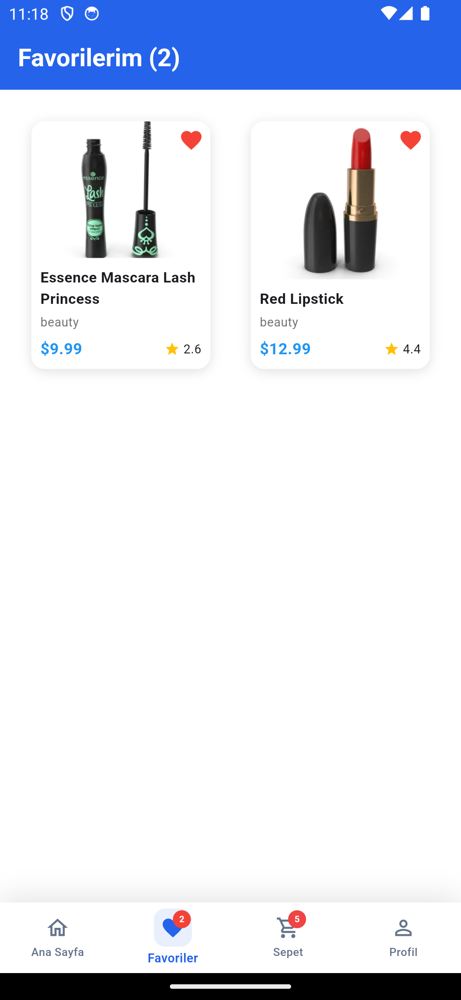 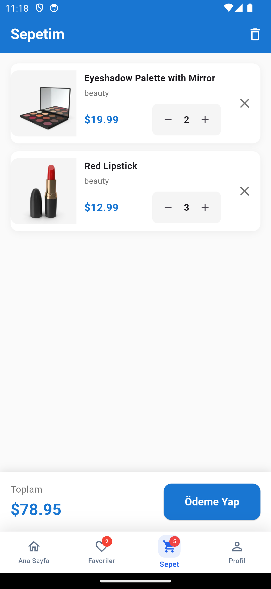

### Checkout Süreci
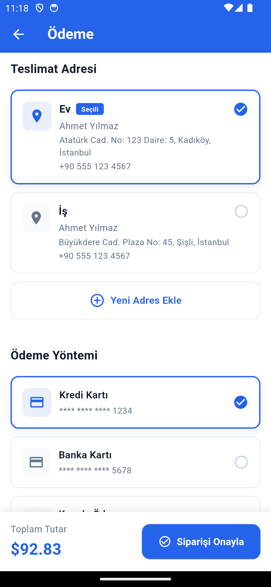 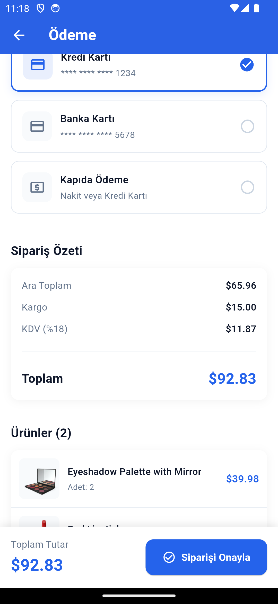 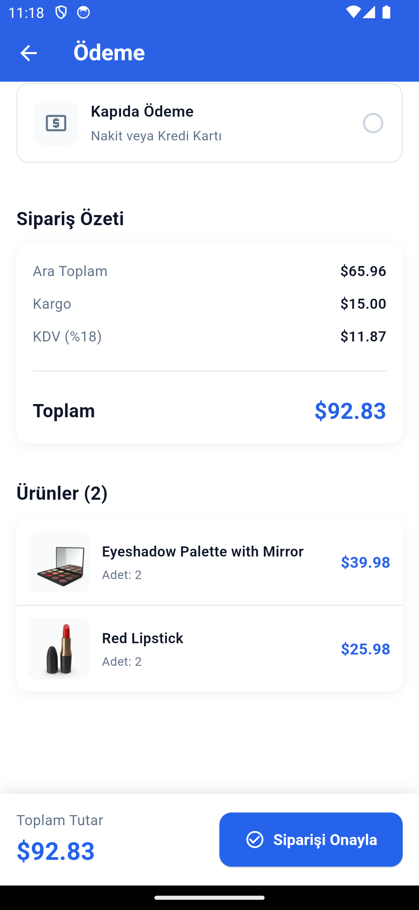

### Sipariş Onayı ve Boş Sepet
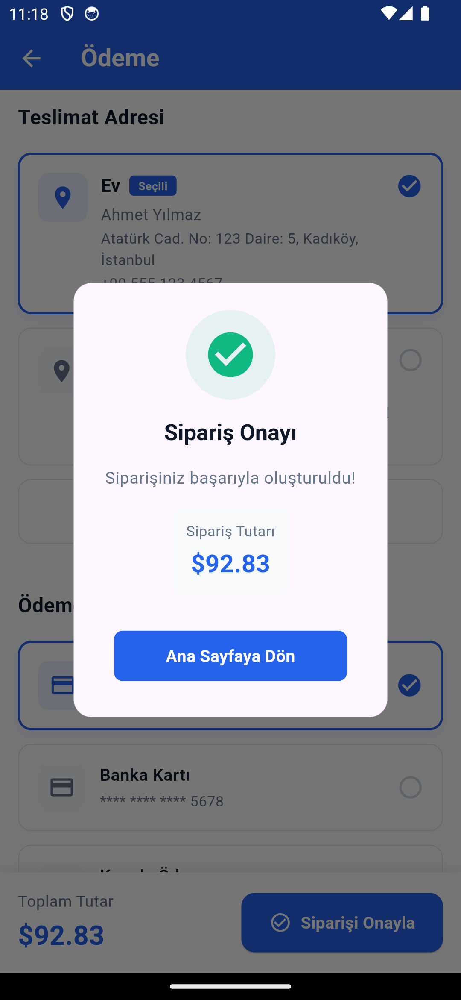 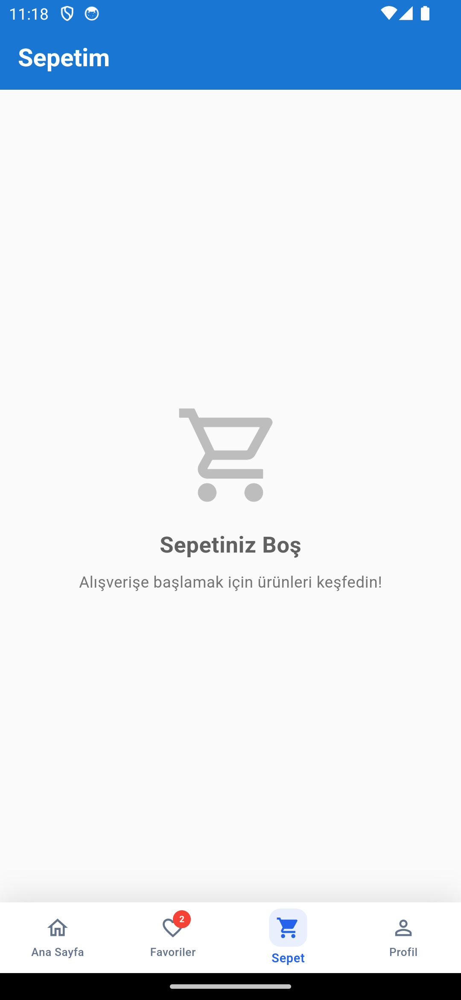

## 🎯 Öğrenilen Konular

Bu proje ile aşağıdaki Flutter konuları uygulamalı olarak öğrenilmiştir:

### 1. Widget Yapısı
- Stateless ve Stateful Widget'lar
- Container, Row, Column, Stack, Positioned
- ListView, GridView, SliverGrid
- Custom Widget Oluşturma

### 2. Navigation
- Navigator.push / pop
- MaterialPageRoute
- Route Arguments ile veri taşıma
- IndexedStack ile tab navigation

### 3. State Management
- setState kullanımı
- ChangeNotifier pattern
- addListener / removeListener
- State yukarı taşıma (lifting state up)

### 4. Veri Yönetimi
- JSON parsing (fromJson/toJson)
- Model sınıfları oluşturma
- REST API entegrasyonu
- Asenkron programlama (async/await)
- Liste filtreleme ve arama
- Kombineli filtreleme (kategori + arama)

### 5. UI/UX Design
- Material Design 3 prensipleri
- Custom theme oluşturma
- Responsive tasarım
- Loading states ve empty states

## 🌐 API Kullanımı

Uygulama, demo amaçlı [DummyJSON API](https://dummyjson.com) kullanmaktadır:

```dart
// Ürün listesi
GET https://dummyjson.com/products

// Response
{
  "products": [
    {
      "id": 1,
      "title": "Essence Mascara Lash Princess",
      "price": 9.99,
      "category": "beauty",
      "rating": 4.94,
      "image": "..."
    }
  ]
}
```

## ⚠️ Notlar

- Bu proje eğitim amaçlı geliştirilmiştir
- Gerçek bir ödeme sistemi içermez
- API verileri demo amaçlıdır
- Kullanıcı kimlik doğrulaması simüledir

## 📝 Lisans

Bu proje MIT lisansı altında lisanslanmıştır.

## 👨‍💻 Geliştirici

**Kursad**
- GitHub: [@kullaniciadin](https://github.com/kullaniciadin)

## 🤝 Katkıda Bulunma

1. Fork edin
2. Feature branch oluşturun (`git checkout -b feature/amazing-feature`)
3. Değişikliklerinizi commit edin (`git commit -m 'feat: add amazing feature'`)
4. Branch'inizi push edin (`git push origin feature/amazing-feature`)
5. Pull Request açın

## 📧 İletişim

Sorularınız için issue açabilir veya e-posta gönderebilirsiniz.

---

⭐ Bu projeyi beğendiyseniz yıldız vermeyi unutmayın!
